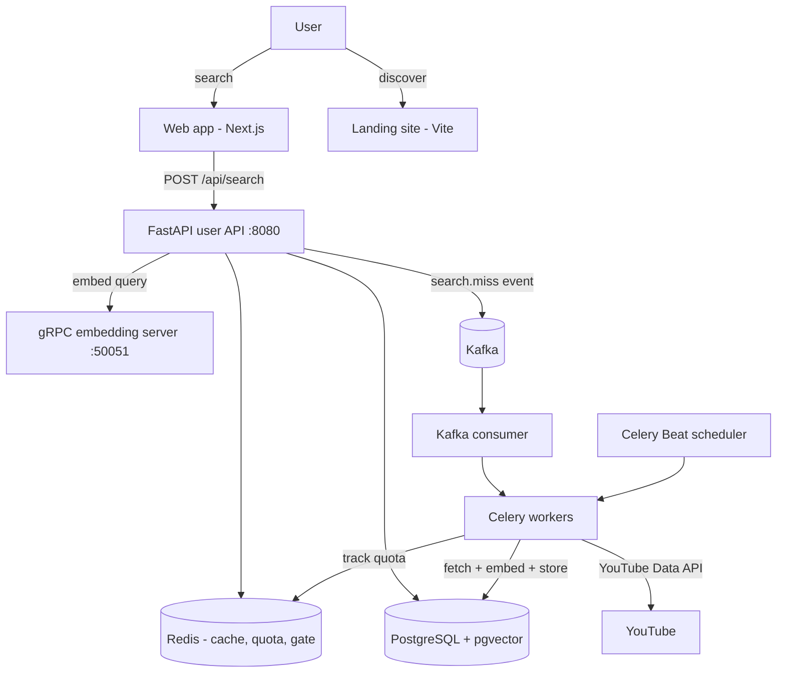

# Recall — Searchable Memory for How to Do Anything

> Find the exact moment anyone explained it.

Recall is an AI-powered semantic search engine for video knowledge. Instead of
returning whole videos, it finds the **precise moment** — down to a few seconds —
where something is explained or demonstrated, and takes you straight there. When
no video moment exists yet, it falls back to an AI text answer, so a search is
**never a dead end**.

The engine launches first for **programming** (developers learning from YouTube
tutorials), but the architecture is field-agnostic: the same pipeline that finds
a `NullPointerException` fix can find a guitar chord change, a suture technique, a
recipe step, or a calculus proof.

---

## The problem

Human knowledge is trapped inside millions of hours of video. You watch a
40-minute tutorial that explains something perfectly — then later you can't find
*which* video it was, or *where* in it the key moment happened. Keyword search
matches titles and tags, not what is actually said on screen. Scrubbing back and
forth isn't search — it's guessing.

## The idea

Recall reads the **spoken content** of thousands of videos, understands a
question asked in plain language, and returns the exact timestamped moment that
answers it — a real human, verified and watchable. If nothing matches well
enough, it generates an AI answer and quietly queues more videos to index for
next time.

---

## How it works (conceptually)

1. **Ask in plain language.** Type a question, describe what you need, or paste an
   error message.
2. **Search inside the videos.** Recall embeds the query and compares it against
   embeddings of every transcript chunk across the indexed catalogue — matching
   meaning, not keywords.
3. **Land on the moment.** Results are ranked, refined, and returned as precise
   timestamps that deep-link into the video at the exact second.
4. **Never empty.** If too few strong matches exist, an AI answer is shown and the
   query is published as a "search miss" event so the missing videos get indexed.

---

## System architecture

Recall is a multi-service system. The backend was originally built in Java Spring
Boot and has been fully re-implemented in Python / FastAPI.



### Services

| Service | Role |
| --- | --- |
| **FastAPI user API** (`:8080`) | Public REST API — search, auth, billing, user, analytics, clips, and Chrome-extension endpoints. |
| **FastAPI admin API** (`:8001`) | Internal administration and pipeline control. |
| **gRPC embedding server** (`:50051`) | Turns text into vectors using `BAAI/bge-base-en-v1.5` (768 dimensions). |
| **PostgreSQL + pgvector** | Primary datastore and vector similarity search. |
| **Redis** | Search-result cache, YouTube API quota tracking, anonymous free-tier gate, and Celery broker. |
| **Kafka** (KRaft mode) | Event bus decoupling search from background indexing. |
| **Celery Worker + Beat** | Background indexing jobs and scheduled crawls. |

---

## The search pipeline

A single query flows through a carefully staged pipeline designed for both
**relevance** and **speed** (sub-second latency budget):

1. **Cache check** — identical recent queries return instantly from Redis (6-hour TTL).
2. **Usage gate** — enforces per-plan search limits (only when monetization is enabled).
3. **Query embedding** — the query is expanded (abbreviations, compound "X vs Y"
   splitting) and embedded via the gRPC server.
4. **Industry & topic routing** — the query vector is matched against industry and
   topic embeddings to narrow the candidate video pool.
5. **Chunk retrieval** — cosine similarity over transcript chunks in pgvector, using
   a quality **threshold** (≥ 0.75) with a top-N fallback for rare/long-tail queries.
6. **Re-ranking** — an optional cross-encoder re-scores candidates at the sentence
   level for pinpoint timestamps.
7. **Language disambiguation** — demotes wrong-language matches (e.g. keeps "Java"
   from being outranked by "JavaScript").
8. **Miss handling** — if too few high-quality results exist, a `search.miss` event
   is published to Kafka to index more videos.
9. **Analytics & cache** — the event is recorded, popular searches updated, and the
   response cached before return.

---

## Content ingestion

Recall continuously grows its catalogue through an automated pipeline:

- **Discovery** — finds new videos and channels via the YouTube Data API, trending
  feeds, topic rotation, and bulk discovery (yt-dlp + curated lists).
- **Quota safety** — every YouTube API call is metered against a daily quota tracked
  atomically in Redis, so the system never exceeds its allowance.
- **Transcript fetching** — pulls captions (with proxy/cookie support to avoid rate
  limits); videos without captions are queued for local Whisper transcription.
- **Chunking** — transcripts are split into two levels: small child chunks (embedded
  and searched) nested inside larger parent chunks (used for surrounding context).
- **Embedding & indexing** — chunks are embedded and stored in pgvector; each video
  gets an aggregate embedding, an auto-detected industry, and topic assignments.
- **Scheduled jobs** (Celery Beat) — hourly trending fetch, 6-hourly channel scans,
  5-minute queue drain, daily channel discovery, and weekly re-classification.

---

## Applications

The repository contains three front-facing pieces plus the backend:

### `python/` — Backend
FastAPI services, the gRPC embedding server, the Celery indexing pipeline, Kafka
consumer, scheduled workers, and the PostgreSQL/pgvector data layer. Key modules:
authentication (JWT), hybrid search, billing (Stripe), analytics, saved clips,
ingestion, and Chrome-extension support.

### `web/` — Product web app (Next.js 14, App Router)
The actual product interface (`:3000`). Includes a landing page, the live search
experience with inline video playback deep-linked to timestamps, a pricing page,
and per-video pages. Talks directly to the FastAPI search API. Ships with a
feature-flagged monetization gate (free daily search limit + upgrade prompts)
that stays hidden until billing is switched on.

### `landing/` — Marketing site (React + Vite)
A cinematic single-page launch site (`:5173`) aimed at Product Hunt / Hacker News
/ Reddit traffic. Opens with the universal vision, narrows to the live programming
demo, and converts visitors to a waitlist. Fully animated (Framer Motion),
responsive, accessible, and reduced-motion aware. All copy is centralized for easy
editing.

---

## Monetization model

Recall uses a **volume-gated freemium** model (currently disabled behind a single
feature flag until launch is ready):

| Tier | Price | What you get |
| --- | --- | --- |
| **Free** | $0 | A limited number of searches per day, no account required (tracked per browser session). |
| **Pro** | $19 / month | Unlimited searches, full history, saved clips, priority results. |

Billing is powered by Stripe (checkout + webhooks). When the billing flag is off,
the product is fully open with no limits or upgrade prompts.

---

## Technology stack

**Backend:** Python, FastAPI, SQLAlchemy (async), PostgreSQL 16 + pgvector, Redis,
Kafka (KRaft), Celery + Celery Beat, gRPC, sentence-transformers
(`BAAI/bge-base-en-v1.5`), a cross-encoder re-ranker, faster-whisper, Stripe,
python-jose (JWT), yt-dlp / youtube-transcript-api.

**Web app:** Next.js 14 (App Router), React 18, TypeScript, Tailwind CSS,
lucide-react.

**Landing site:** React 18, Vite, TypeScript, Tailwind CSS, Framer Motion,
lucide-react.

---

## Project structure

```
YT/
├── python/            # Backend: FastAPI, gRPC, Celery, workers, data layer
│   ├── api/           #   User-facing API (routers, services, schemas)
│   ├── main.py        #   Admin API
│   ├── services/      #   embedding, indexing, transcript, crawler, classifier
│   ├── workers/       #   Kafka consumer + Celery Beat scheduler
│   └── db/            #   Models, sessions, migrations
├── web/               # Product web app (Next.js)
│   └── src/           #   app/ (routes), components/, lib/, types/
├── landing/           # Marketing landing site (Vite + React)
│   └── src/           #   components/, hooks/, lib/ (all copy)
└── README.md
```

---

## Vision & roadmap

- **Now:** Live semantic search for programming, continuous automated indexing,
  product web app, and a launch-ready marketing site.
- **Next:** User accounts and login, activating monetization, deployment of the full
  service stack, and a YouTube API quota strategy for scale.
- **Later:** Expand beyond programming — students, musicians, cooks, fitness,
  medicine, trades, languages, designers — and add on-screen code/text
  understanding (OCR) alongside spoken-word search.

Recall's mission: **human knowledge shouldn't be locked inside a 40-minute video.**

---

## Status

Actively in development. The backend search pipeline and ingestion are functional;
the web app and landing site are built; user authentication, live monetization,
and production deployment are the current focus.
